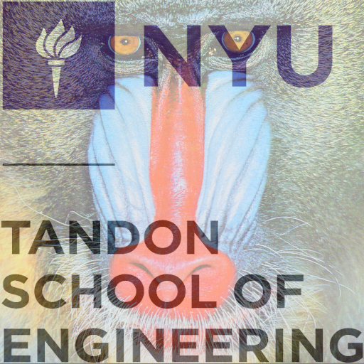
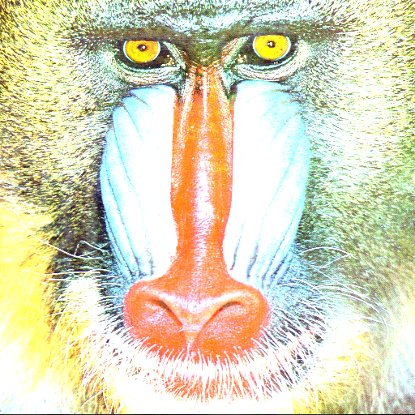
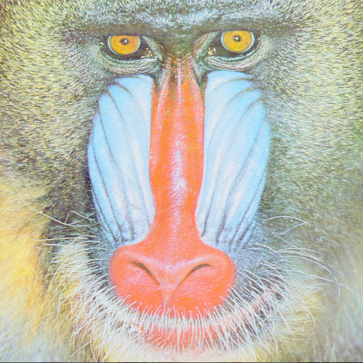
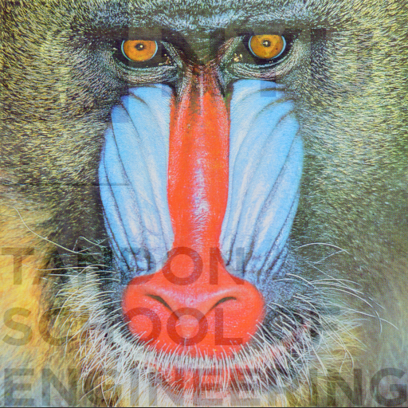
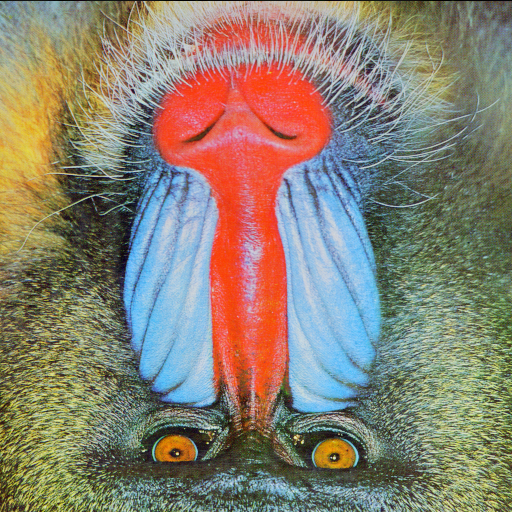
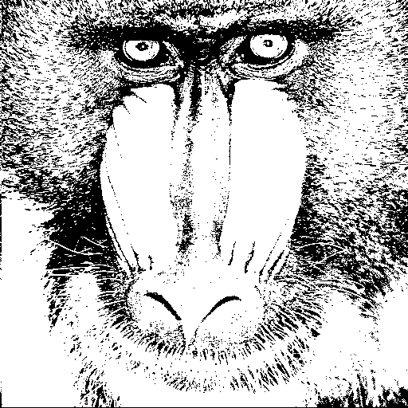
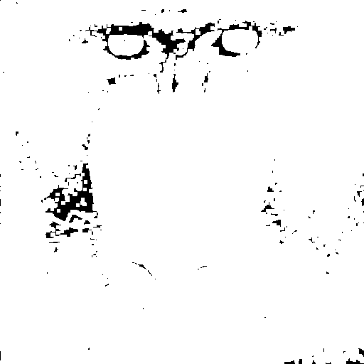
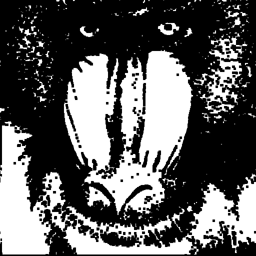
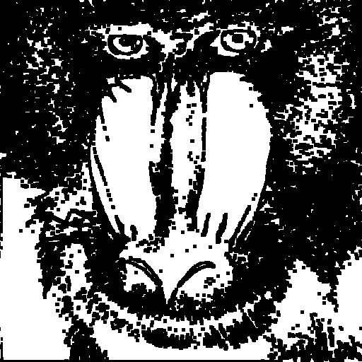

# Assignment-1-images-Kurisute
Author : Yichen Xie\
Date: Sep/22/2021

## Assignment Tasks
For the introduction to assignment tasks, see
[Assignment 1:Image](https://github.com/nyu-cs-cy-6533-fall-2021/base/blob/main/Assignment_1/requirements/Assignment-1_Images.md)

## Installation
This project is built by CMAKE. Try:
```shell
> cmake .
> make
```
## Result Generation
You can generate experiment results in **test_outputs** folder by running bin file in the project folder:
```shell
./computer_graphics_assignment1_bin
```
However, you have to change the project path in main.cpp for your own environment. And you also have to remove all the .ppm files in the test_output folder before this generation to avoid overwritting problems.


## Mandatory Tasks Results
The pre-produced results can be found in the **test_outputs** folder.

### Overloading of add(+), subtraction(-):


### Overloading of add-assignment(+=), subtraction-assignment(-=):



### Overloading of scale operation(*):


### Gamma Correction with gamma=2.2


### Alpha Composition with alpha=0.50 and 0.85




### Mirror operation on X axis


## Optional Tasks Results
### Binaryzation of Mandrill-gray with threshold=100


### Erosion operation with 5*5 square filter


### Dilation operation with 5*5 square filter


### The final Result: Dilation minus Erosion

